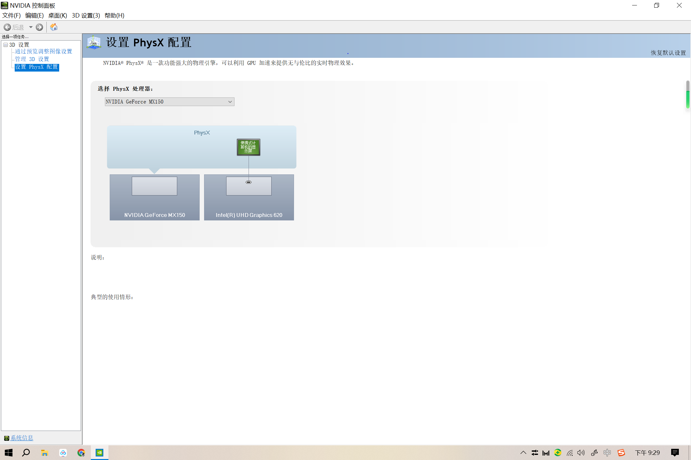
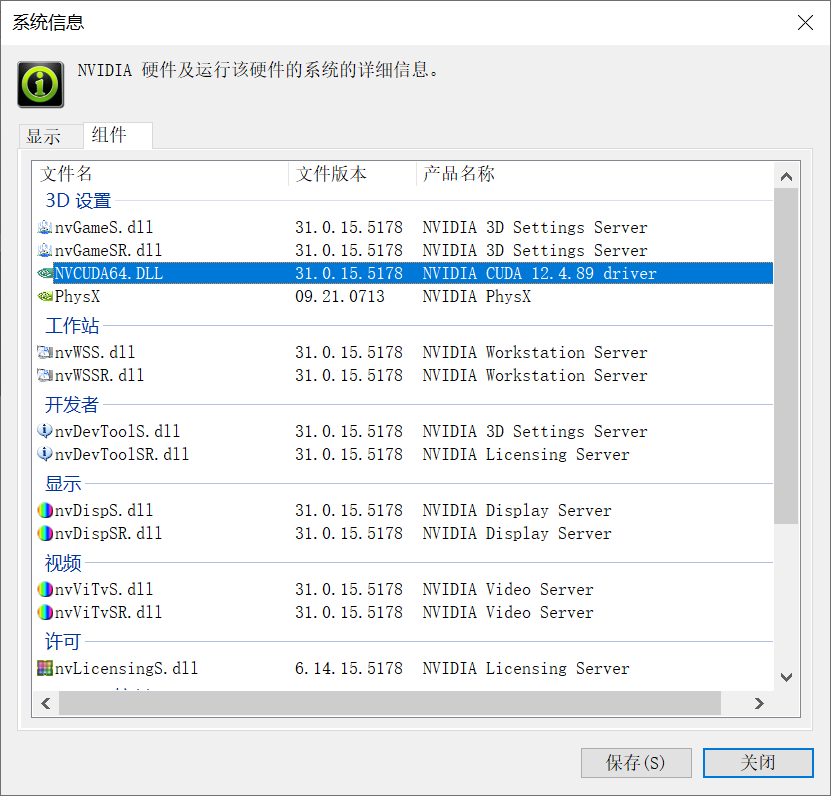

# 1、环境的准备

0、Python环境的安装

[推荐conda的方式安装python](https://hly-tech.gitbook.io/language/v/python/python-huan-jing-de-an-zhuang)

1、设备的选择

mac是不支持的，因为很多AI项目都是基于NVIDIA显卡上进行的，所以，我们要选择一般有NVIDIA的电脑，其实一般的电脑都会有，我刚好有一台matebook13，所以，是支持CUDA的。

2、查看系统支持NVIDIA中的驱动的版本是多少。

基本操作：

《1》 桌面上右键选择NVIDIA控制面板 / 直接搜索NVIDIA控制面板

《2》点击左下角的“系统信息 ”

《3》选择“组件”&#x20;

就可以看到我们的驱动的版本了，我这里是12.4.89 ，所以，我们可以选择12.4的驱动

<figure><figcaption>
NVIDIA控制面板
</figcaption></figure>

<figure><figcaption></figcaption></figure>

进入[CUDA Toolkit archive 下载12.4.1](https://developer.nvidia.com/cuda-toolkit-archive)的版本

<figure><figcaption>
选择合适的版本
</figcaption></figure>

3、安装CUDA&#x20;

安装的过程中可能遇到visual的错误，我们可以选择custom自定义的方式，把CUDA中的vF选项去掉，经过查阅，这个选项是和Microsoft Visual Studio工具有关的，我们这里不需要。

4、安装成功之后，在终端输入命令行查看cuda的版本信息。

`nvcc -V`

或

nvidia-smi ，可以查到我们的cuda的信息。

至此cuda安装基础完成。


注意

CUDA 是否成功工作，还要看有关项目中的CUDA安装的版本是否合适，不过项目的CUDA和当前的CUDA不是一个概念。 那它们是啥关系？？暂保留疑问


