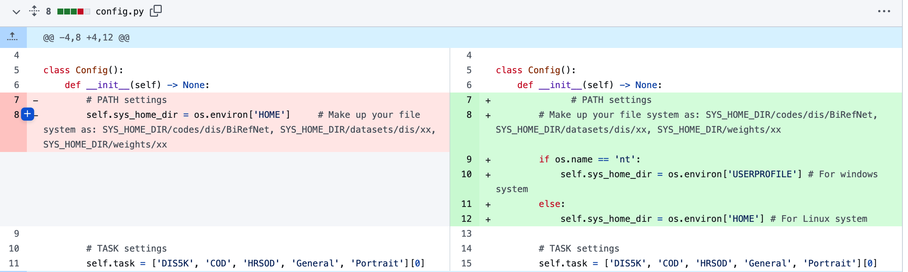

# background-removal本地安装使用

0、前置条件：电脑本身环境安装好了，[AI基础环境](https://hly-tech.gitbook.io/ai/1-huan-jing-de-zhun-bei)


1、下载项目，然后安装依赖

`git clone https://huggingface.co/spaces/not-lain/background-removal.git`&#x20;

`cd background-removal`

`pip install -r requirement.txt`&#x20;


2、检查当前的torch是否支持cuda了

在终端输入python进入repl环境。

```
import torch 
print(torch.__version__) # 查看torch版本
print(torch.cuda.is_available()) #查看torch的cuda是否可行，false不可行，true正确
torch.version.cuda 查看torch对应的cuda版本
```

额外命令

```
print(torch.cuda.divece_count()) # 查看可行的cuda数目
```


3、 如果当前的torch环境不可行，要安torch，cuda，torchvision匹配。

在t[orch匹配cuda的网址找到对应的whl](https://download.pytorch.org/whl/torch\_stable.html)文件，下载下来然后安装

安装命令：

```
pip install xxxx.whl # 安装完成，即为torch和cuda的环境匹配上了
```


4、安装torch和torchVision的匹配&#x20;

到[`torch和torchvision匹配网址`](https://pytorch.org/get-started/previous-versions/)下找命令，复制下来，在终端执行


到此，项目的环境安装完成。



注意：3、4步骤如果有冲突，可以将原来的版本先卸载掉，然后再安装



5、运行项目


#### 遇到的问题：

1》  [遇到“HOME”目录的问题](https://huggingface.co/spaces/not-lain/background-removal/discussions/2)&#x20;

原因：

是因为ZhengPeng7/BiRefNet这个项目的脚本都是针对linux系统的，而我们运行在window上出现目录获取失败的问题。

解决方案：

1）在我们的项目安装的[ZhengPeng7/BiRefNe](https://github.com/ZhengPeng7/BiRefNet)下面修改HOME的目录获取【推荐】

<figure><figcaption></figcaption></figure>

2）等待库更新【我已经提交了PR，已经被接受，相信未来会更新】


2》 [Failed to import pytorch fbgemm.dll or one of its dependencies is missing](https://discuss.pytorch.org/t/failed-to-import-pytorch-fbgemm-dll-or-one-of-its-dependencies-is-missing/201969)

从[网上下载](https://www.dllme.com/dll/files/libomp140\_x86\_64/00637fe34a6043031c9ae4c6cf0a891d/download#google\_vignette) fbgemm.dll库下来，解压之后放到 “**C:\Windows\System32**” 目录下

[解决参考](https://stackoverflow.com/questions/78114412/import-torch-how-to-fix-oserror-winerror-126-error-loading-fbgemm-dll-or-depen)
