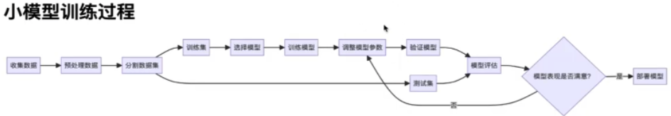

# 1、大模型基础概念

## 1、什么是大模型？

大模型（Large Language Models, LLM）是指拥有数十亿或者百亿个参数的大模型预训练语言模型， 入GPT系列模型。&#x20;

## 2、语言建模（Language Model， LM）

语言建模是提高机器语言只能的主要方法之一。&#x20;

LM旨在对词系列的生成概率进行建模， 以预测未来（或缺失）tokens的概率。

`统计语言模型 ——> 神经语言模型 ——> 预训练语言模型 ——> 大模型`

#### 1》 统计语言模型

<figure><figcaption></figcaption></figure>

#### 2》 神经语言模型

<figure><figcaption></figcaption></figure>

#### 3》 预训练语言模型

<figure><figcaption></figcaption></figure>

<figure><figcaption></figcaption></figure>

#### 4》 大语言模型

<figure><figcaption></figcaption></figure>

## 3、大模型的应用

<figure><figcaption></figcaption></figure>

<figure><figcaption></figcaption></figure>

<figure><figcaption></figcaption></figure>

## 4、大模型特点

<figure><figcaption></figcaption></figure>

## 5、大模型问题

<figure><figcaption></figcaption></figure>

## 6、大模型分类

<figure><figcaption></figcaption></figure>

## 7、大模型 vs 小模型

<figure><figcaption></figcaption></figure>

打磨新改变了NLP的范式

<figure><figcaption></figcaption></figure>

## 8、大预言莫西小姑娘与AIGC之间的区别

AIGC（Artificial Intelligence Generated Content，人工智能生成内容）是一个总称，指有能力生成内容的人工智能模型。AIGC可以生成文本、生成代码、生成图像、视频和音乐。

热门的开源AIGC技术：LLaMA、Stable Diffusion。

大模型也是一种AIGC，它基于文本进行训练并生成文本内容。

