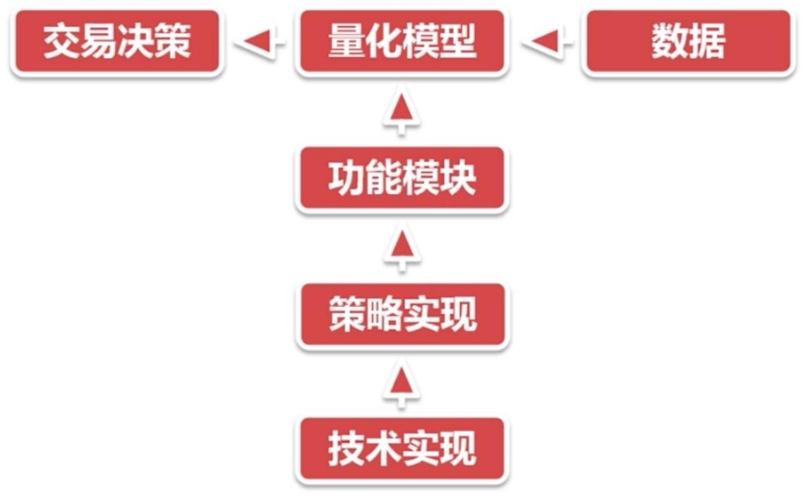

# 课程详细内容

## 量化交易.pdf 内容完整整理（含图片版）

### 一、量化交易的认识

\
&#xNAN;_&#x56FE;1：量化交易核心流程（从数据输入到策略执行）_

#### 1.1 什么是量化交易

量化交易以计算机强大运算能力为支撑，以数学模型为思维核心，以历史数据为基础，通过数学建模、统计学分析、编程设计作为工具，最终制定大概率获利的交易策略。

#### 1.2 量化交易的优势

* 以从历史规律中发现的概率优势作为投资基础
* 依靠计算机运算能力，保证分析的广度与效率
* 能够有效克服人性中的弱点（如贪婪、恐惧等）对交易决策的干扰

#### 1.3 量化交易的核心

无论构建的模型多么复杂，不存在能长期不变、一直赚钱的模型；人并非机器的奴隶，模型需要人持续更新优化，同时需要人主动去寻找市场上的新规律。

#### 1.4 量化交易的过程

量化交易过程包含交易决策、量化模型、数据三大核心要素，同时涉及策略实现与技术实现两大功能模块。

<figure><figcaption></figcaption></figure>

### 二、Pandas基础工具

#### 2.1 Series数据对象

**（1）Series数据对象的生成**

* 生成方法：`s = pd.Series(data, index=index)`
* 支持的数据类型：list（列表）、ndarray（多维数组）、字典、常量

**（2）Series数据对象的访问**

访问方法包括：`s.values`（获取数据值）、`s.index`（获取索引）、索引访问、切片访问。

#### 2.2 DataFrame数据对象

\
&#xNAN;_&#x56FE;2：Pandas DataFrame数据结构（行索引+列索引+二维数据）_

**（1）DataFrame数据对象的生成**

* 生成方法：`df = pd.DataFrame(data, index=index, columns=columns)`
* 支持的数据类型：列表组成的字典、嵌套列表、Series组成的字典、字典组成的字典、二维ndarray等

**（2）DataFrame数据对象的访问**

访问方法包括：`df.index`（获取行索引）、`df.columns`（获取列索引）、`df.values`（获取数据值）、`df.loc`（按标签访问）、`df.iloc`（按位置访问）、`df.ix`（混合访问）。

### 三、股票数据的获取

\
&#xNAN;_&#x56FE;3：股票数据两大获取途径（CSV导入 vs API接口）_

#### 3.1 CSV文件导入股票数据

* 数据来源：通过同花顺软件导出CSV格式的股票数据
* 转换方法：将CSV文件数据转换为DataFrame的方法为 `pd.read_csv()`

#### 3.2 其他获取方式

* API接口下载：可通过API接口直接下载股票数据，涉及网络爬虫相关技术
* 金融数据模块：使用金融数据模块中的 `DataReader()` 方法获取股票数据

### 四、股票数据的处理

\
&#xNAN;_&#x56FE;4：股票数据处理核心步骤（概况查看→缺失值处理→特殊值处理）_

#### 4.1 股票数据规整化处理

**（1）数据概况查看**

查看股票数据内容概况的方法：`head()`（查看前几行）、`tail()`（查看后几行）、`shape`（查看数据维度）、`describe()`（查看数据统计描述）、`info()`（查看数据基本信息）。

**（2）缺失值处理**

缺失值处理方法：`isnull()`（判断缺失值）、`notnull()`（判断非缺失值）、`dropna()`（删除缺失值）、`fillna()`（填充缺失值）。

#### 4.2 股票数据特殊值处理

**（1）数据精度处理**

精度处理方法：`round()`（四舍五入）、`astype()`（数据类型转换）、`applymap()`（对DataFrame每个元素应用函数）、`lambda()`（匿名函数，配合其他方法使用）。

**（2）指定数值处理**

可通过相关方法查找数据中指定的数值，并根据需求进行针对性处理。

### 五、课程总结

\
&#xNAN;_&#x56FE;5：量化交易课程知识体系（理论→工具→数据操作）_

本课程围绕量化交易展开，核心内容包括量化交易介绍、数据（数据结构、数据获取）、数据的分析与处理，形成了从理论认知到工具应用，再到实际数据操作的完整知识体系。

<figure><figcaption></figcaption></figure>

