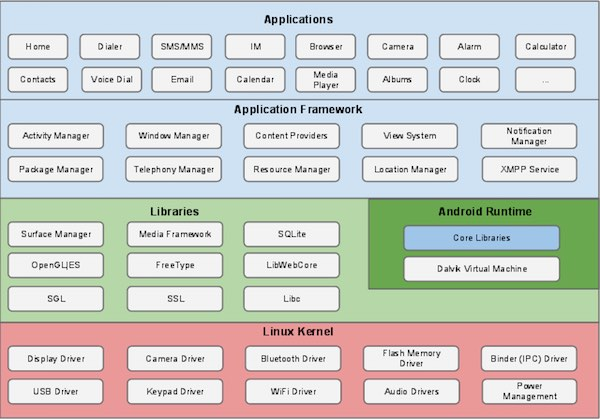

# 概览

1、Android是基于Linux上面开发的系统

#### 2、Android 开发优势

1）开放源代码

2）众多开发者以及强大的社区

3）不断增长的市场

4）国际化的APP集成

5）低廉的开发成本

6）更高的成功几率

7）丰富的开发环境

<figure><figcaption>
Android系统结构
</figcaption></figure>

<figure><figcaption>
程序库
</figcaption></figure>

<figure><figcaption>
Android运行环境
</figcaption></figure>

<figure><figcaption>
应用框架
</figcaption></figure>

<figure><figcaption>
应用程序组件
</figcaption></figure>

<figure><figcaption>
相当于iOS后台线程
</figcaption></figure>

<figure><figcaption></figcaption></figure>

<figure><figcaption></figcaption></figure>

<figure><figcaption></figcaption></figure>

<figure><figcaption></figcaption></figure>

[Android的MVX](https://blog.csdn.net/u013651026/article/details/78295367)

<figure><figcaption>
生命周期
</figcaption></figure>

<figure><figcaption></figcaption></figure>

<figure><figcaption>
（serive）点击绑定服务
</figcaption></figure>

3、 broadcast  receiver 低电量的广播： 系统会发出这样的一个广播； 通讯过程中传递过来的数据， 或者说很久都不会出现一次这样的情况， ，频率比较低， 比价慢，运行效率比较低；&#x20;

<figure><figcaption></figcaption></figure>

<figure><figcaption></figcaption></figure>

Intent android的核心预activity相关联的数据对象；Intent 概念intentFilter 概念显示Intent和隐式IntentAndroid 意图(Intent)和过滤器(Filter)Android意图是一个要执行的操作的抽象描述。它可以通过 startActivity 来启动一个活动，broadcastIntent 来发送广播到任何对它感兴趣的广播接受器组件，startService(Intent) 或者bindService(Intent， ServiceConnection, int) 来与后台服务通讯。意图本身（一个 Intent 对象）是一个被动的数据结构，保存着要执行操作的抽象描述。例如，你有一个活动，需要打开邮件客户端并通过 Android 设备来发送邮件。为了这个目的，你的活动需要发送一个带有合适选择器的 ACTION\_SEND 到 Android 意图处理者。指定的选择器给定合适的界面来让用户决定如何发送他的邮件数据。打电话之前肯定会有对应的选择；frameLayout 和iOS的frame式一个样的直接指定；LinearLayout 线性布局RelativeLayout 相对布局TableLayout 表格布局AbsoluteLayout 绝对布局（弃用）android 上面的布局南方是， 同事studio 3 只会有个contraint的方式进行布局；[https://blog.csdn.net/guolin\_blog/article/details/53122387](https://blog.csdn.net/guolin\_blog/article/details/53122387)这个布局方式，是在2017 之后studio 2.0 之后才出现的布局方式；所有的语言都会有列表这个内容来展示对应的列表；

使用了点击监听的接口，出现了错误； （为什么监听了接口，点击没有进入到这个方法里面呢？）为什么点击会出现问题？listView中的convertView的内容也是经过转换的，也就是可以实现的内容；radiogroup是一个单选题；checkbox 实现一个多选的选项的内容；Datepicker 就是一个日期选择器； Datepicker.实现日期的选择timerpicker.时间选择器Spinner 组建的使用。选项组建。箭头向下的选择组建Progressebar 进度条Seekbar.可以调整进度的Gridview   网格布局。有点类似iOS中collectionview. ProgressDialog 进度框Notification   通知Scrollview  可以滚动的视图android 上面的后腿事件；autocomplete 编辑文本上面的自动补全； EditText  编辑的文本， 内容上面的处理；资源访问： 1、字符串资源，  string.xml 在android 的manifest里面使用了； 完全的内容，生的id都是在R的文件里面；程序使用字符串资源2、国际化，  【字符串资源还是有国际化的功能】国际化，就是设置不同的额地区，就是展示不同的内容语言； 3、颜色资源，  4、尺寸资源 （上面这两个都是通过xml来实现的资源进行访问）5、数据资源，（就是实现对应的内容来进行完成），这个是创建一个array.xml 的文件进行数组的数据进行存储； 6、Drawable资源 （我们看到我们经常是放图片在里面，）分别又不同的分辨率：l  m  h  x xx 这几个对应的屏幕，这些屏幕上面的内容的处理； 所以，需要不同的图片进行设置内容； 7、Android资源访问之样式和主题，  Values 的格式里面的styles.xml 的内容； 同事也是可以针对一类控件进行展示样式； 8、菜单资源， 项目里面有一个menu的文件夹，&#x20;

