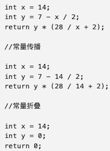

# 编译器优化——常量折叠/传播

### 常量折叠

constant folding 常量折叠；编译器优化技术之一，通过对编译时常量或常量表达式进行计算来简化代码。

i = 320 \* 200 \*32&#x20;

上面的代码中。<mark style="color:red;">**编译器通常会在代码的中间表示**</mark> (ntemediate Representation） （关于中间表示．《JRockit权威指南》中有示例对代码生成过程进行说明）<mark style="color:red;">**中对该常量表达式进行计算**</mark>，直接计算出 320 \* 200 \* 32 的值，而不会在此生成2个乘法指令。

### 常量传播

constant propagation，常量传播，编译器优化技术之一，可以<mark style="color:red;">**在一段代码中，将表达式中的常量替换为相关表达式或字面量**</mark>，再使用常量折叠技术来简化代码。

<figure><figcaption></figcaption></figure>

