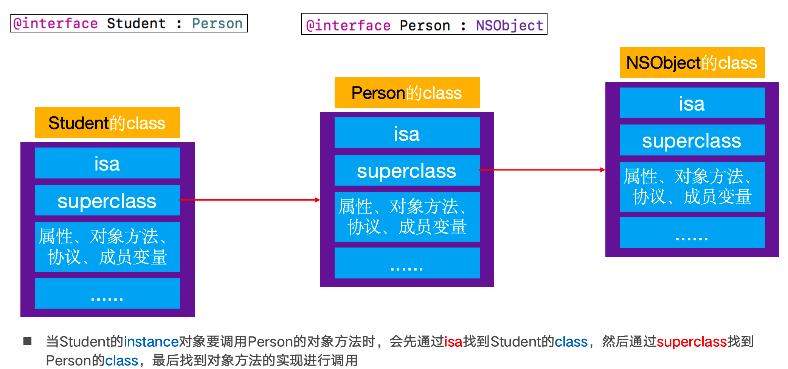

# Charles 监听https请求\[iOS开发]

Charles抓取https的请求：

&#x20;1、下载安装Charles&#x20;

2、选择install Charles root certificate 安装证书， root certificate ，这个安装要到钥匙串中设置为信任 。 设置为始终信任。 这样，mac上作为root的证书就安装完成了。&#x20;

safari上安装证书： iPhone 16 模拟器上，安装了证书。 在charles上选择安装模拟器的证书，

<figure><figcaption></figcaption></figure>

然后再模拟器的safari中输入：[http://charlesproxy.com/getssl](http://charlesproxy.com/getssl)会显示允许和拒绝， 我们选择allow。 【这个地方要注意快速选择，否则会被重定向到其他页面】就会下载对应的证书下来。&#x20;

<figure><figcaption></figcaption></figure>

<figure><figcaption></figcaption></figure>

打开模拟器的设置，在第一行会显示profile downloaded , 点击进去安装就好了。

<figure><figcaption></figcaption></figure>

<figure><figcaption></figcaption></figure>

然后返回设置的第一个页面，选择General(通用)， 然后About， Certificate Trust Settings ,

就可以看到有关设置的开关了，打开开关就好了。

如果么有对应的开关，就是在safari浏览的那个地址没有下载对应的profile下来。 重新关闭safari，输入链接下载处理。
