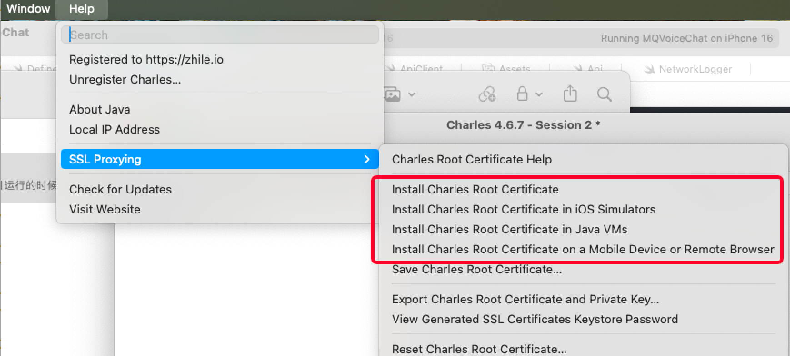

# 2.火山RTC的sdk配置不同的target

## 原因：

火山的 RTC sdk在M芯片的mac上运行到模拟器上失败，所以，通过创建不同的target来运行在真机上，一个target运行在模拟器上，便利于能够使用SWiftUI的preview的能力。


## 大体流程：

### 1. 直接复制当前的target【创建还是复制】

### 2. 修改名字

### 3. 修改target的名字和配置文件【如果不修改名字，这个步骤是不用】【这里的配置文件其实就是配置info.plist文件】

### 4. 修改文件都配置有这个target， 因为默认是原来的

### 5. 修改第三方库都有对应的配置。【podfile 或者spm】


## 详细流程：

### 1.复制Target

<figure><figcaption></figcaption></figure>

<figure><figcaption></figcaption></figure>

如果只是暂时使用，可以不用修改，这一步完成。&#x20;

**为什么要使用复制，而不是创建？**

因为我们一般都是基于一个已经有的项目创建新的target，而大部分的内容是相同的。&#x20;


### 2.修改名字：

直接双击就可以在这个页面修改名字了，比如修改为PreView.

<figure><figcaption></figcaption></figure>

但是，发现target还是copy后缀的那个，就需要去修改scheme了。

<figure><figcaption></figcaption></figure>

删除这个scheme，然后基于target重新创建和target一样名字的scheme。

<figure><figcaption></figcaption></figure>

然后点击OK，就可以看到这个scheme了。&#x20;

### 3. 给这个target配置info.plist 文件

1）修改plist配置文件名&#x20;

<figure><figcaption></figcaption></figure>

可以修改info.plist文件的名字。 PreView-info.plist .&#x20;

2）在build setting配置这个info.plist

创建一个文件夹，存放对应的plist文件，然后配置上这个路径就可以了。

<figure><figcaption></figcaption></figure>

然后就是配置这个路径：

<figure><figcaption></figcaption></figure>

<figure><figcaption></figcaption></figure>

这样路径就配置好了。

### 4. 配置文件的Membership

<figure><figcaption></figcaption></figure>

发现文件的membership并没有跟随到新增的target， 所以，我们要去添加，一个个添加不显示。

<figure><figcaption></figcaption></figure>

这里批量现金爱， 然后删除不需要的文件。&#x20;

### 5. 给项目添加第三方库

<figure><figcaption></figcaption></figure>

&#x20;看了一下，项目里面的这个Target没有添加到这些库

1. **Pod给Target添加库**

```
# Uncomment the next line to define a global platform for your project
source 'https://cdn.cocoapods.org/'
source 'https://github.com/volcengine/volcengine-specs.git'

platform :ios, '14.0'

def shared_pods
  use_frameworks!
  use_modular_headers!

  #  local pods
  pod "SVGAPlayer", :path => "../Third_lib/cocoapods/SVGAPlayer-iOS"
  pod "QGVAPlayer", :path => "../Third_lib/cocoapods/vap"

 pod 'TZImagePickerController'

 #remote network pods
 pod 'NIMSDK_LITE' # 云信
 pod 'SnapKit' # 约束库
 pod 'SwiftyFitsize'  # 适配库
 
 pod 'FCUUID' #添加唯一的设备码
 pod 'HandyJSON'
 
 pod 'SwiftUIIntrospect'
 
end

target 'WAAW' do
 pod 'VolcEngineRTC','3.58.1.100'  #火山

 shared_pods
  
  target 'WAAWTests' do
    inherit! :search_paths
    # Pods for testing
  end

  target 'WAAWUITests' do
    # Pods for testing
  end

end

target 'WAAWPreViewUI' do
  shared_pods

end

target 'PreView' do
  
  shared_pods

end

post_install do |installer|
    installer.generated_projects.each do |project|
        project.targets.each do |target|
            target.build_configurations.each do |config|
                config.build_settings['IPHONEOS_DEPLOYMENT_TARGET'] = '14.0'
            end
        end
    end
end


```

2. &#x20;**SPM给Target添加库**


需要手动添加每个库，感觉有点繁琐，<mark style="color:red;">看看以后是否直接可以到里面配置修改？</mark>


1\) 给项目添加WAAW

<figure><figcaption></figcaption></figure>

2）给Target添加， 设置为那个Target

<figure><figcaption></figcaption></figure>

moya 这个库依赖rxSwift 和ReactiveSwift ， 这两个库， 所以可以先添加。
