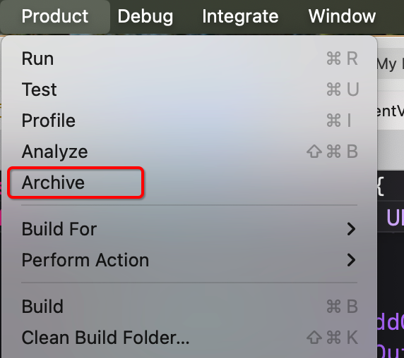

# Create-dmg

### 1、作用

主要用来将mac上的xx.app的应用打包成为dmg应用

### 2、实践过程

在[github](https://github.com/create-dmg/create-dmg)上是开源的；

官方提供了安装的命令： `brew install create-dmg`

如果上面的这个安装的软件，在执行的时候老是出现错误，可以换一种方式

`npm install -g create-dmg`

重新安装尝试

### 3、执行创建过程

#### 3.1 、archieve

将xcode上的线面archive，获取到里面的dmg文件拷贝到一个路径下

操作：

<figure><figcaption></figcaption></figure>

#### 3.2、将xx.app 创建为xx.dmg 项目

`create-dmg VCB.app`&#x20;

这样就通过VCB.app创建了一个VCB.dmg 的mac安装包了。

### 4、提供给其他人使用

#### 1、直接发给别人

#### 2、听过github上的release

vcb在release上

#### 3、通过brew， 让别人安装

[创建brew的源软件](https://app.gitbook.com/s/VudVGowEJiiTWxGP51Wb/brew)

