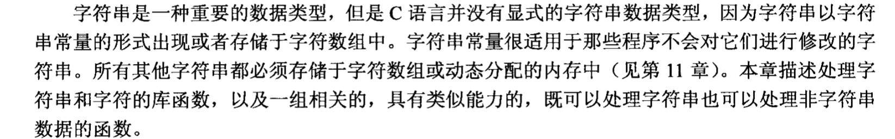

# 字符串

<mark style="color:orange;">**字符串是字符的数组，以空字符**</mark><mark style="color:orange;">** **</mark><mark style="color:orange;">**`'\0'`**</mark><mark style="color:orange;">** **</mark><mark style="color:orange;">**结尾。**</mark>


<figure><figcaption></figcaption></figure>

<mark style="color:purple;">Q: 为什么使用字符数组表示字符串？</mark>

C 语言并没有显式的字符串数据类型，因为字符串以字符串常量的形式出现或者存储于字符数组中。

字符串常量很适用于那些程序不会对它们进行修改的字符串。

所有其他字符串都必须存储于**字符数组**或**动态分配**的内存中。


<mark style="color:purple;">Q: 为什么使用\0 表示结束？</mark>

字符串就是一串零个或多个字符，并且以一个位模式为全 0 的 NUL 字节结尾。因此，字符串所包含的字符内部不能出现 NUL 字节。这个限制很少会引起问题，因为 NUL 字节并不存在与它相关联的可打印字符，这也是它被选为终止符的原因。NUL 字节是字符串的终止符，但它本身并不是字符串的一部分，所以字符串的长度并不包括 NUL 字节。[ASCII查询](https://en.wikipedia.org/wiki/ASCII)， 字符串的原型头文件在string.h中。


## 1. **字符串的声明和初始化**

### **1.1、字符数组**：

#### **1.1.1初始化**：可以使用双引号来初始化字符串，编译器会自动在末尾添加空字符 `'\0'`。

```c
char str[6] = "Hello";  // 包含 'H', 'e', 'l', 'l', 'o', '\0'
char str[] = "Hello";  // 自动大小为 6
```

#### **1.1.2手动定义**：也可以手动定义字符数组并指定空字符：

```c
char str[6] = {'H', 'e', 'l', 'l', 'o', '\0'};
```

### 1.2、指针：

```
char *str = "hello"; 
```


## 2、字符串的可变与不可变

字符串的可变与不可变特性主要取决于**其存储方式和使用场景**。

### &#x20;2.1. 字符串字面量（不可变）

在C语言中，字符串字面量（如`"hello"`）是不可变的。这些字符串通常存储在只读的内存区域，程序试图修改它们会导致未定义行为，甚至崩溃。例如：

```c
char *str = "hello";
str[0] = 'H';  // 可能导致程序崩溃
```

`str`是一个指向字符串字面量的指针，**虽然你可以改变指针本身指向的地址，但不能修改指针所指向的字符串内容。**

### 2.2. 使用数组存储的字符串（可变）

如果你使用字符数组存储字符串，则该字符串是可变的，因为数组分配的内存是可读写的。例如：

```c
char str[] = "hello";
str[0] = 'H';  // 合法，修改了数组中的内容
```

这里的`str`是一个字符数组，存储在可写的内存区域，因此你可以修改数组中的字符。

### 2.3. 使用`const`修饰符（不可变）

如果你希望某个字符串不能被修改，可以通过使用`const`关键字来标记字符串不可变。例如：

```c
const char *str = "hello";
str[0] = 'H';  // 编译器会报错，表示不能修改
```

`const`指针意味着你不能通过该指针修改字符串的内容，即便它指向的是可写的内存区域。



<mark style="color:red;">**小结**</mark>：

* 字符串字面量存储在只读内存中，通常是不可变的。
* 使用字符数组存储的字符串是可变的。
* 使用`const`修饰符可以让编译器确保字符串不可被修改。


## 3. **字符串的操作**

### **3.1. 长度**：可以使用 `strlen()` 函数计算字符串的长度（不包括空字符）。

```c
#include <string.h>
size_t strlen(char const * string); // 函数原型
int length = strlen(str);  // length 为 5
```

<figure><figcaption></figcaption></figure>


**不受限制的字符串函数**

最常用的字符串函数都是“不受限制”的，也就是说它们只是通过寻找字符串参数结尾的 NUL 字节来判断它的长度。

这些函数一般都指定一块内存用于存放结果字符串。在使用这些函数时，<mark style="color:orange;">程序员必须保证结果字符串不会溢出这块内存。</mark>


### **3.2 复制**：使用 `strcpy()` 函数复制字符串。【<mark style="color:orange;">不受限制的字符串函数</mark>】

```c
char dest[6];
strcpy(dest, str);  // 将 str 复制到 dest
```

<figure><figcaption></figcaption></figure>

### **3.3 连接**：使用 `strcat()` 函数连接两个字符串。

```c
char str1[10] = "Hello";
char str2[10] = "World";
strcat(str1, str2);  // str1 变为 "HelloWorld"
```

<figure><figcaption></figcaption></figure>

<figure><figcaption></figcaption></figure>

### **3.4. 比较**：使用 `strcmp()` 函数比较两个字符串。

```c
if (strcmp(str1, str2) == 0) {
    // 字符串相等
}
```

<figure><figcaption></figcaption></figure>

### 3.5  与上面对应的受限长度的函数

<figure><figcaption></figcaption></figure>

<figure><figcaption></figcaption></figure>

### 3.6 字符串查找基础

<figure><figcaption></figcaption></figure>

<figure><figcaption></figcaption></figure>

<figure><figcaption></figcaption></figure>

<figure><figcaption></figcaption></figure>

### 3.7 高级字符串查找

<figure><figcaption></figcaption></figure>

<figure><figcaption></figcaption></figure>

### 3.8 内存操作

<figure><figcaption></figcaption></figure>

<figure><figcaption></figcaption></figure>

## **注意事项**

### **1、空字符**：

字符串必须以 `'\0'` 结尾，以便函数知道字符串的结束位置。

### **2、缓冲区溢出**：

在处理字符串时，要确保数组有足够的空间以容纳字符串及其结尾的空字符，避免缓冲区溢出。

### 3、增删改查

基本上都是需要循环来进行处理的。


## 总结

在 C 语言中，字符串是以空字符结尾的字符数组。通过标准库提供的函数，可以方便地进行字符串的操作，如复制、连接和比较。
