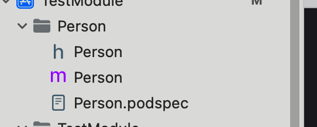

# pod+module 管理代码

### 1、组织代码文件

<figure><figcaption></figcaption></figure>

### 2、podspec 文件和以前一样


### 3、在podfile文件中写入对应的

```
target 'TestModule' do
  # Comment the next line if you don't want to use dynamic frameworks
  use_modular_headers!
  pod "Person", :path => "./Person/"

#  use_frameworks!
#  pod 'YourLocalPod', :path => '../path_to_your_local_pod'
  # Pods for TestModule

end
```

注意：我们是本地的文件，不是库，把use\_frameworks!注释掉

使用 use\_modular\_headers! 就定义了组织成为模块


### 4、执行命令安装

```
pod install
```


### 5、导入这个模块使用

<figure><figcaption></figcaption></figure>


参考代码： [https://github.com/hly-code-source/exmaples/tree/main/oc/TestModule](https://github.com/hly-code-source/exmaples/tree/main/oc/TestModule)

