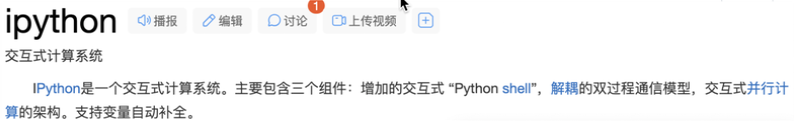

# iPython

<figure><figcaption></figcaption></figure>

[http://ipython.readthedocs.io/en/stable/install/index.html\
安装，（当然还有其他的内容）\
\
http://ipython.readthedocs.io/en/stable/interactive/tutorial.html](http://ipython.readthedocs.io/en/stable/install/index.html%E5%AE%89%E8%A3%85%EF%BC%8C%EF%BC%88%E5%BD%93%E7%84%B6%E8%BF%98%E6%9C%89%E5%85%B6%E4%BB%96%E7%9A%84%E5%86%85%E5%AE%B9%EF%BC%89http:/ipython.readthedocs.io/en/stable/interactive/tutorial.html%E8%AF%A6%E7%BB%86%E7%9A%84%E6%95%99%E7%A8%8B%E6%9C%89%E5%BE%85%E7%BB%A7%E7%BB%AD)

[详细的教程有待继续](http://ipython.readthedocs.io/en/stable/install/index.html%E5%AE%89%E8%A3%85%EF%BC%8C%EF%BC%88%E5%BD%93%E7%84%B6%E8%BF%98%E6%9C%89%E5%85%B6%E4%BB%96%E7%9A%84%E5%86%85%E5%AE%B9%EF%BC%89http:/ipython.readthedocs.io/en/stable/interactive/tutorial.html%E8%AF%A6%E7%BB%86%E7%9A%84%E6%95%99%E7%A8%8B%E6%9C%89%E5%BE%85%E7%BB%A7%E7%BB%AD)
