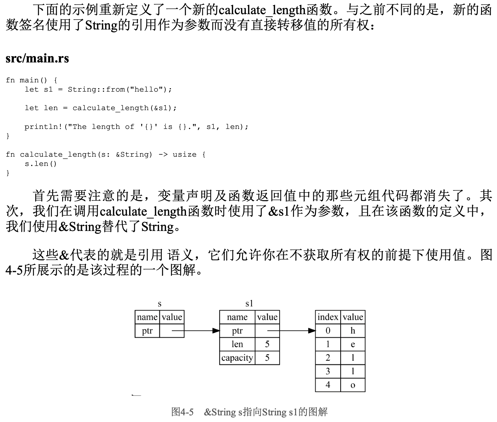

# 引用与借用

由于调用calculate\_length会导致String移动到函数体内部，而我们又希望在调用完毕后继续使用该String，所以我们不得不使用元组将String作为元素再次返回。

<figure><figcaption></figcaption></figure>

<figure><figcaption></figcaption></figure>

<figure><figcaption></figcaption></figure>

<figure><figcaption></figcaption></figure>

