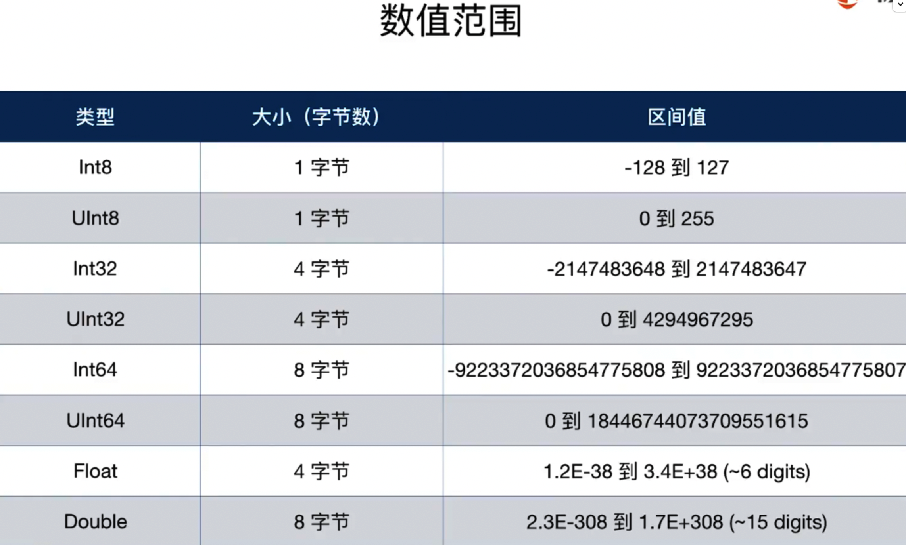

# Map

## 1、Map

> 对与原始集合里的每个元素，以一个变换后的元素替换之，形成一个新的集合

<figure><figcaption></figcaption></figure>

## 2、flatMap

源于元素是集合的集合，可以得到单级的集合。

其实就是将集合里面的集合经过操作之后展开。

```
let results = [[1,2,3], [4,5,6], [7,8,9]]
//let allResults = results.flatMap{$0.map{ $0 } }
let allResults = results.flatMap{$0.map{ $0 * 10 } }
let passMarks = results.flatMap{$0.filter{ $0 > 5 } }
print(allResults)
print(passMarks)
输出：
[10, 20, 30, 40, 50, 60, 70, 80, 90]
[6, 7, 8, 9]
```

## 3、compactMap

过滤空值；

对于数组，返回非空值，

```
let keys:[String?] = ["张三", nil, "lisi"]
let validNames = keys.compactMap{$0}
print(validNames)
let counts = keys.compactMap{ $0?.count }
print(counts)
输出：
["张三", "lisi"]
[2, 4]
```


## 4、compactMapValues

返回字典的value不为空的的键值对。

```
let dict = ["key1": nil, "key2": 20]
let result = dict.compactMap{ $0 }
print(result)

let result1 = dict.compactMapValues{ $0 }
print(result1)
输出：
[(key: "key1", value: nil), (key: "key2", value: Optional(20))]
["key2": 20]
```

