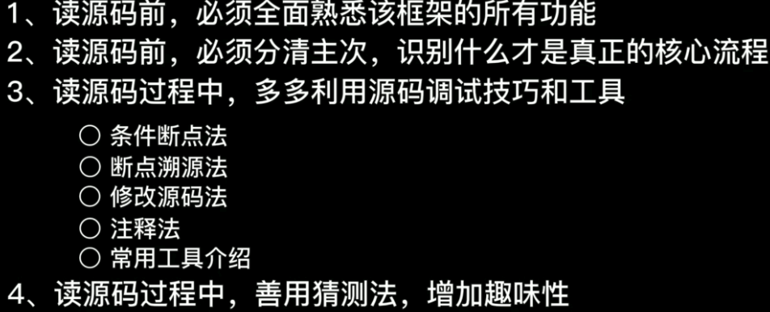

# 读源码的建议步骤

<figure><figcaption></figcaption></figure>

1、一个注解就相当于一个功能&#x20;

2、框架源码 = 功能代码 —— 要掌握项目的代码，首先要了解业务才能够读懂那些代码。

3、读代码前，一定要分清主次。 什么是主流程，什么是次流程？ spring有很多流程，我们应该跳出来，思考一下spring真正的核心是什么？ spring的核心是什么？是bean，如何创建出来的， 所以我们应该读spring是如何创建一个bean的流程源码。 而不是srping启动的源码。


总结：

1、读源码前，必须全面熟悉该框架的所有功能 【其实也不一定了解所有功能， 也许只是了解一部分，如果知识了解一部分，那就读那一部分的源码就好了】

2、读源码前面，先思考什么事主要的

3、使用调试、注释、常用工具等

4、读源码过程中，可以猜测， 每次看源码是什么之前，可以先停下来思考，猜一猜它们是怎么实现的？&#x20;


