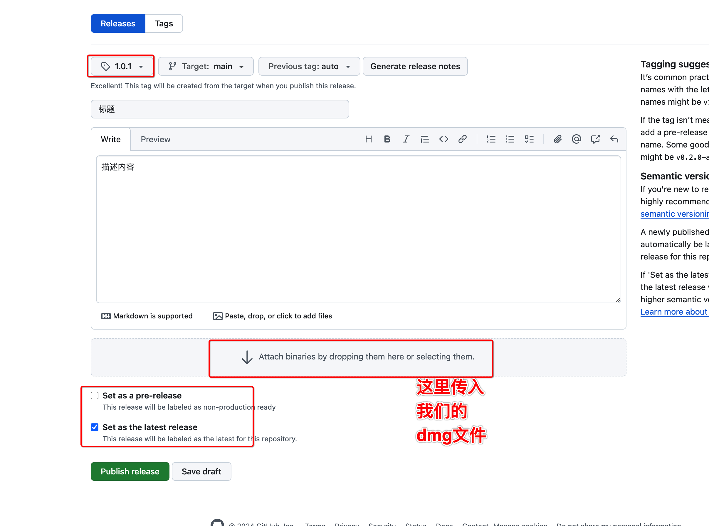

# github的项目发布release

### 1、进入release的操作页面

<figure><figcaption></figcaption></figure>

### 2、进入这个

<figure><figcaption></figcaption></figure>

通过各种选项的设置，以及传入dmg文件，这样在我们的github的项目上就能够生成release了，

默认有source的包， + 我们传的dmg包

### 3、生成的页面

<figure><figcaption></figcaption></figure>

### 其他

1、[dmg的生成参考](https://app.gitbook.com/s/IAjQgZnbQIolEePFfNLh/e-wai-gong-ju/create-dmg)
