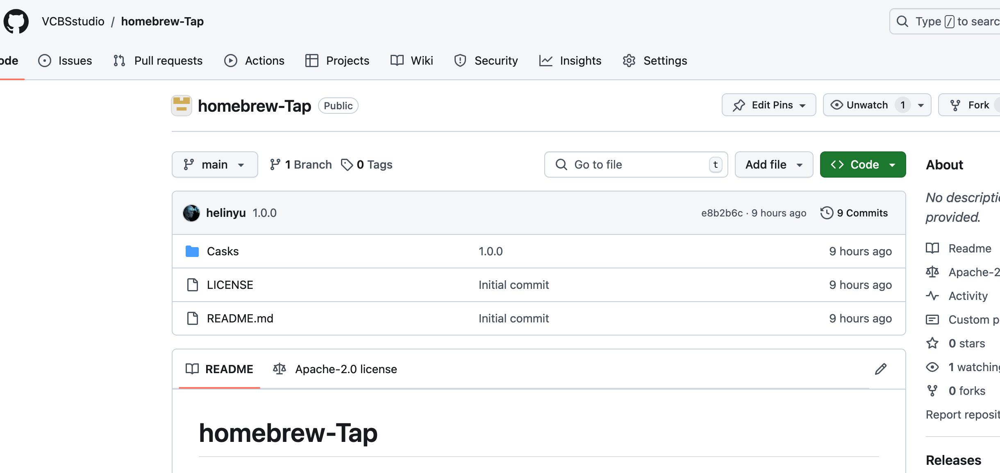

# 创建brew软件源

### 1、创建项目

在github上创建一个空白项目，取名字为homebrew-Tap ，当然名字可以随便去

<figure><figcaption></figcaption></figure>

### 2、创建xx.rb文件

因为我们当前的是mac的dmg文件，所以需要创建Casks目录，然后创建xx.rb 文件。

<figure><figcaption><p>目录结构</p></figcaption></figure>

### 3、填写rb文件内容

<figure><figcaption></figcaption></figure>

注意先写各个选项，然后上传到github就行了。&#x20;


### 4、安装

```
brew tap your_username/cask-vcb
brew install --cask vcb
```

这里的vcb是我的名字， your\_username 是我们项目所在的账户的名字，可能是组织名


如果出现找不到的情况，可以untap之后再宠幸tap。

```bash
brew untap your_username/cask-vcb // 移除某个tap
brew tap // 查看当前的tap有哪些
```

####

