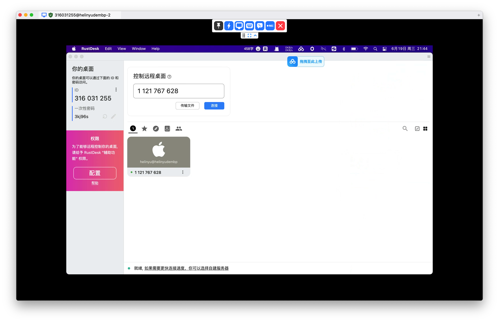

# 2、远程控制桌面

介绍一个开源的远程桌面控制项目 [**rustdesk**](https://github.com/rustdesk/rustdesk/blob/master/docs/README-ZH.md)：

### 一、功能介绍：

1、远程控制桌面 （安装的软件默认是官方提供的）

2、可以配置服务器，可以配置自己的服务器； （至于怎么配置自己的服务器可以看github上的文档了）

### 二、下载软件

[下载合适自己电脑的版本](https://github.com/rustdesk/rustdesk/releases)

然后两边电脑上都安装了

### 三、打开软件【输入被控制方的账号和一次性密码】

<figure><figcaption>
输入账号
</figcaption></figure>

<figure><figcaption>
输入密码
</figcaption></figure>

<figure><figcaption>
连接成功
</figcaption></figure>

***

当然，我们国内常见的远程桌面控制软件还有[**向日葵**](https://sunlogin.oray.com/download)
