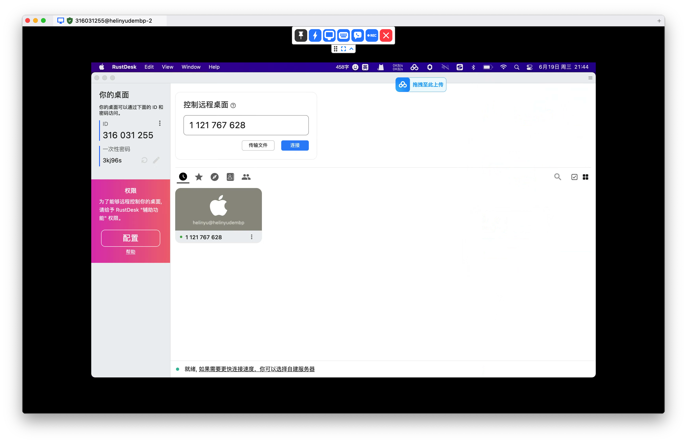

# 订阅免费的VPN地址

1、github上罗列一些免费vpn地址的项目：[https://github.com/Cry1ngMan/1](https://github.com/Cry1ngMan/1)&#x20;

2、打开其中一个地址，&#x20;

eg: [https://oss.v2rayse.com/proxies/data/2024-06-06/14GIMko.txt](https://oss.v2rayse.com/proxies/data/2024-06-06/14GIMko.txt) &#x20;

返回的结果是[base64](http://base64.us/) 之后的了，我们解base64之后的结果：

<figure><figcaption></figcaption></figure>

可以看到协议是vless,可以查看其他的几个地址，都是vmess等等，所以，我们要下载这个协议支持的软件： 我这里选择了<mark style="color:red;">**v2ray**</mark>&#x20;

3、安装[v2ray](https://www.v2ray.com/awesome/tools.html) 软件，选择合适自己电脑的版本

4、我的电脑是Mac，点击右上角图标，打开列表， 点击“<mark style="color:red;">**订阅设置**</mark>”， 然后将开源项目的订阅地址填写进去， 然后点击<mark style="color:red;">**“更新”**</mark>。

<figure><figcaption></figcaption></figure>

5、点击软件图标，然后选择ping， 进行ping网络测速；

6、选择代理模式和代理的服务器地址；

<figure><figcaption>
可选择的代理模式
</figcaption></figure>

<figure><figcaption>
选择服务器列表
</figcaption></figure>

<figure><figcaption>
选择服务器的地址进行尝试
</figcaption></figure>

勾选上一个，然后测试youtube.com ,在浏览器上访问，如果能够访问就可以了，如果不行，就换一个地址。

查看我选择成功额结果：

<figure><figcaption></figcaption></figure>

