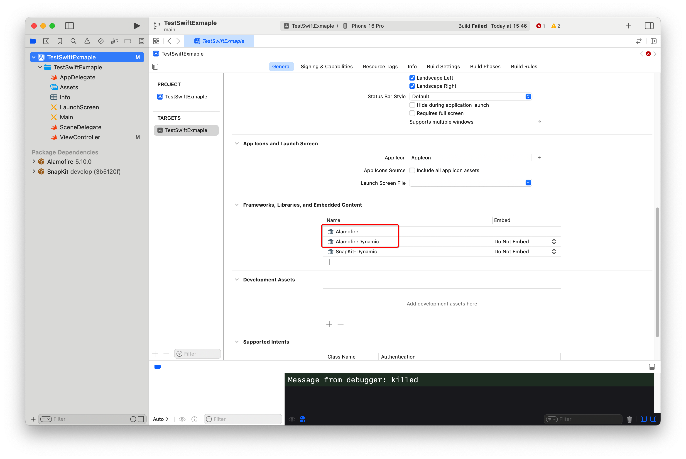

# clang: error: no such file or directory:

clang: error: no such file or directory: '/Users/helinyu/Library/Developer/Xcode/DerivedData/TestSwiftExmaple-cglsdhrhidjznhbpycozaliyaams/Build/Products/Debug-iphonesimulator/PackageFrameworks/AlamofireDynamic.framework/AlamofireDynamic'

这个是因为项目里卖弄使用了动态库，所以我们要将静态库去掉。

<figure><figcaption></figcaption></figure>

删除灭有dynamic的这个静态库。

