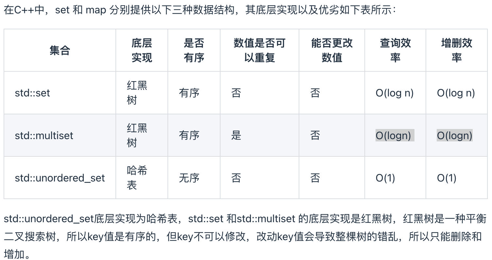

# 哈希表(HashTable)

### 1、数据结构

* 数组: 存储哈希表的基础结构，用于存放元素。【必须有】
* 树（链表）: 用于处理冲突的结构，链式哈希使用链表，而一些现代实现可能使用树（如红黑树）来提高查找性能。

### 2、哈希函数（Hash Function）:

哈希函数是将输入（键）映射到固定大小输出（哈希值）的一种函数。理想的哈希函数应具有以下特性：

* 快速计算：能迅速将键(原始值) 映射到哈希值。
* 均匀性：能够将输入均匀分布在哈希表中，减少冲突的可能性。
* 碰撞抵抗：不同的输入应尽可能生成不同的哈希值。

### 3、冲突处理（Collision Resolution）:

哈希表中多个键可能映射到相同的哈希值，这种情况称为冲突。常见的冲突处理方法有：

* 链式哈希（Chaining）：在每个哈希表槽中维护一个链表，用于存储冲突的元素。
* 开放地址哈希（Open Addressing）：当发生冲突时，寻找下一个可用的位置存储元素，方法包括线性探测、二次探测和双重哈希。

### 4、核心操作（增删查改）

* 删除: 计算键的哈希值，找到对应的索引并删除相应的键值对，同时处理冲突链表中的元素。
* 插入: 计算键的哈希值，找到对应的数组索引，存储键值对。
* 查找: 计算键的哈希值，定位到数组索引，并查找相应的值。

### 5、性能指标:

* **平均时间复杂度**: 理想情况下，插入、查找和删除操作的时间复杂度为 O(1)，但在高负载因子或严重冲突的情况下，最坏情况可能达到 O(n)。
* **负载因子**（Load Factor）: 负载因子是哈希表中元素数量与哈希表容量的比值。负载因子越高，冲突的可能性越大。通常需要根据负载因子动态调整哈希表的大小。
* **动态调整**: 为了保持高效性能，哈希表常常在负载因子达到一定阈值时，自动扩展或缩小容量，并重新计算哈希值以保持均匀分布。

### 7、实现方式:

* 静态哈希表: 大小固定，适合已知元素数量的场景。
* 动态哈希表: 大小可变，能够自动调整，以适应动态数据的增长。

### 8、应用场景:

* 数据库索引
* 缓存系统
* 唯一元素存储（如去重）
* 频繁查找的场景
* 适合需要快速查找和插入的场景

### 9、哈希表的特性包括：

1. 快速查找: 哈希表的平均时间复杂度为 O(1)，支持快速的插入、查找和删除操作。
2. 键值对存储: 哈希表存储数据为键值对，每个键唯一地映射到一个值。
3. 哈希函数: 通过哈希函数将键转换为数组索引，确保数据的分布尽量均匀，以减少冲突。
4. 冲突处理: 当不同的键映射到相同的索引时，需要通过冲突解决策略（如链式哈希或开放地址法）来处理。
5. 动态扩展: 哈希表可以根据负载因子动态调整大小，通常在元素数量超过一定比例时进行扩展，以保持性能。
6. 无序性: 哈希表中的元素是无序的，不保证插入顺序，无法直接遍历。
7. 内存使用: 哈希表的内存使用效率与负载因子和哈希函数的设计密切相关，过高的负载因子可能导致性能下降。这些特性使得哈希表在处理大量数据时具有良好的性能和灵活性，广泛应用于各种场景。

### 10、三种基础的数组结构（hashtable/set/map）:

1. 哈希表（Hash Table）: 基于数组实现，通过哈希函数将键映射到数组索引。常用于快速查找、插入和删除操作。
2. 哈希集合（Hash Set）: 基于哈希表实现的集合数据结构，支持快速查找和去重。
3. 哈希映射（Hash Map）: 基于哈希表实现的映射数据结构，允许将键映射到值，支持快速查找、插入和删除。

4. 链式哈希（Chaining Hashing）: 在哈希表的每个索引位置维护一个链表，用于解决哈希冲突。
5. 开放地址哈希（Open Addressing Hashing）: 在哈希表中，当发生冲突时，寻找下一个空位存储数据，常用的方法有线性探测、二次探测和双重哈希。

6. 动态哈希（Dynamic Hashing）: 允许哈希表在运行时动态调整大小，以适应数据的增长，常用于数据库系统。
7.
8. 分布式哈希表（Distributed Hash Table, DHT）: 用于分布式系统中的数据存储和查找，常见于P2P网络。

这些哈希结构在实现高效的数据存储和检索方面具有重要作用。

C++中的[Set](https://app.gitbook.com/s/Xko7hXP8ZNDwNDAKRAZr/c++/ju-he-shu-ju-jie-gou/stl/guan-lian-rong-qi/ji-he-set) 、[Map](https://app.gitbook.com/s/Xko7hXP8ZNDwNDAKRAZr/c++/ju-he-shu-ju-jie-gou/stl/guan-lian-rong-qi/ying-she-guan-lian-map)

<figure><figcaption></figcaption></figure>

<figure><figcaption></figcaption></figure>

虽然std::set和std::multiset 的底层实现基于红黑树而非哈希表，它们通过红黑树来索引和存储数据。不过给我们的使用方式，还是哈希法的使用方式，即依靠键（key）来访问值（value）。所以使用这些数据结构来解决映射问题的方法，我们依然称之为哈希法。std::map也是一样的道理。

总结一下，当我们<mark style="color:red;">**遇到了要快速判断一个元素是否出现集合里的时候，就要考虑哈希法**</mark>。 但是哈希法也是牺牲了空间换取了时间，因为我们要使用额外的数组，set或者是map来存放数据，才能实现快速的查找。

<mark style="color:red;">**不同的编程语言，对于hashtable、set、map 这样的结构名字有差别， 这些集合需要关注的是：**</mark>

&#x20;<mark style="color:red;">**1)是否有序**</mark>&#x20;

<mark style="color:red;">**2）键是否可以重复**</mark>

<mark style="color:orange;">注意其他的set/ map 在使用哈希表的时候是使用什么作为初始化值，什么是hash之后的值。存储的是什么？ 要搞清楚这一点</mark>
